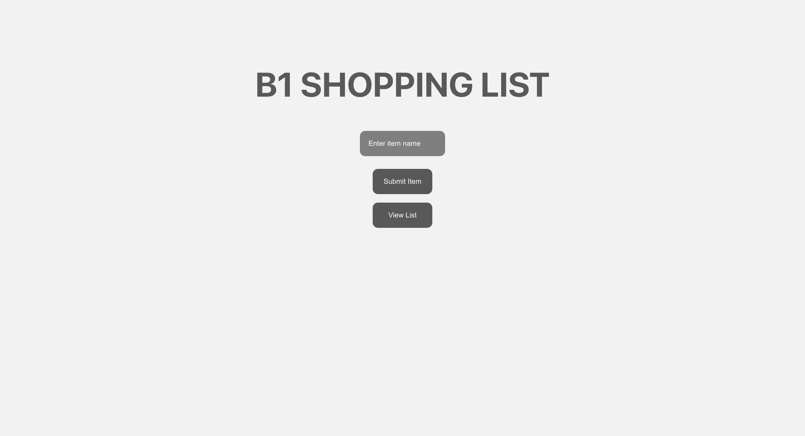
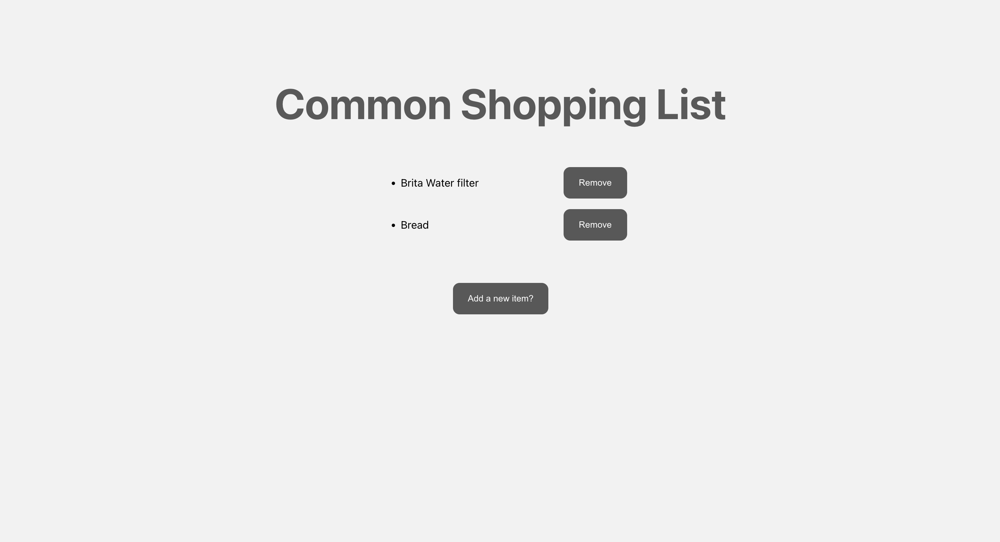

# B1-Shopping-List

This is a straight-forward and simple web application, which is fully responsive, that allows tenants of an apartment to maintain a shopping list shared by the apartment.

## Technologies used

- React.js

- Firebase

- Vercel

## Application

### Landing page view

### Shopping list page view

## Running this repository

- Fork and then clone this repository using `git clone https://github.com/{YourUserName}/B1-Shopping-List.git`.

- cd into this repository and run `npm install`, which will install all the required packages.

- On your firebase console, create a collection, called `shoppingList`, in your database for your application.

- Copy your firebase configurations in a file called firebaseConfig.js (or for ease, just paste it in firebaseConfig_vercel.js).

- Run `npm start` to run the application.

## Acknowledgments

- [React.js](https://react.dev/)

- [Firebase](https://firebase.google.com/)